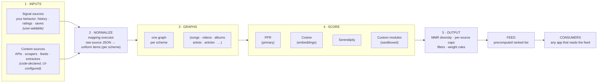

<div align="center">

# recommenderr

**A self-hosted, platform-agnostic recommendation engine you can see inside — and tune.**

Point it at any kind of content — videos, music, **articles, news, posts** — declare where the
candidates come from and what a "good" item looks like, and it builds a personalized feed from *your*
behavior through a transparent, tunable pipeline. No black box, no cloud, no account.

[](https://fastapi.tiangolo.com/)
[](#the-pipeline)
[](https://www.sqlite.org/)
[](#deployment)
[](#license)

</div>


_The admin UI at `/admin/` — every source, scheme, scorer, weight, and consumer as a live node-and-cable pipeline you can tune._

---

## Table of contents

- [What is this?](#what-is-this)
- [Why](#why)
- [The pipeline](#the-pipeline)
- [Schemes & sources](#schemes--sources)
- [Recommending something new](#recommending-something-new)
- [Used by — the yt-platform ecosystem](#used-by--the-yt-platform-ecosystem)
- [Tech stack](#tech-stack)
- [Repository layout](#repository-layout)
- [Deployment](#deployment)
- [Development](#development)
- [Privacy & egress](#privacy--egress)
- [License](#license)

---

## What is this?

**recommenderr** is a general recommendation engine. Its data model is a **generic item store** with
user-definable **schemes** (content types): you declare a scheme's fields, and items go into a
JSON-backed table the rest of the engine treats uniformly. Everything downstream — graphs, scoring,
the ranked feed — is generic over those items (`compute_ppr` is generic over string keys).

It ships with four pre-built schemes — `yt_video`, `music_track`, `music_album`, `music_artist` — and a
source pack tuned for YouTube + music, because that's the ecosystem it was built for. But none of that
is baked in: declare an `article`, `news_story`, or `post` scheme, wire up sources of the right kind,
and the same pipeline recommends those instead. **As long as it's configured properly, it'll recommend
anything.**

> **recommenderr is standalone.** The **yt-platform** ecosystem — [`ytvideo`](https://github.com/iversonianGremling/ytvideo),
> [`ytmusic`](https://github.com/iversonianGremling/ytmusic), and the [`ytfrontend`](https://github.com/iversonianGremling/ytfrontend)
> SPA — is the *reference set of consumers* built on top of it (see [below](#used-by--the-yt-platform-ecosystem)).
> The engine itself doesn't know or care what it's recommending.

## Why

Most recommenders are either a black box you can't inspect or hard-wired to one platform. This one is
neither:

- **Recommendations are a first-class, debuggable system.** The engine has a visual admin — a
  node-and-cable canvas where you watch what each source returns, adjust weights, enable/disable
  scorers, and see *why* a given item was recommended (`GET /why/{id}`).
- **Domain lives at the edges, not the core.** Only *sources* and *schemes* know about a domain, and
  both are declarative. The candidate-generation, graph, and scoring layers are content-agnostic and
  reusable across any consumer.
- **Everything is yours.** Your behavior, items, and ranked feeds live in local SQLite on your own
  machine. Nothing is sent to an analytics or cloud service.

---

## The pipeline

`recommenderr` is built as an explicit left-to-right pipeline. The admin UI renders it as the
interactive canvas shown above; the same model is below. It's the same five stages no matter what the
items *are*.



1. **Inputs** — *signal sources* (your behavior: views, ratings, saves, playlists) and *content
   sources* (third-party APIs, scrapers, RSS feeds, extractors). Signal sources are user-addable;
   content sources are code-declared and only *configured* (enable, weight, credentials).
2. **Normalize** — the mapping executor maps each source's raw JSON into the uniform item shape its
   scheme declares. Some sources run passthrough.
3. **Graphs** — one personalized-PageRank graph per scheme.
4. **Score** — **PPR** is the primary scorer, with optional **Cosine** (Ollama embeddings, Rocchio),
   **Serendipity**, and **custom sandboxed modules** blended in. Per-listener **personas** can be
   scored independently. Every scorer's enabled-state and weight is visible and tunable.
5. **Output → Feed → Consumers** — diversity/dedup/filtering produce a precomputed ranked feed that any
   consumer reads. A per-graph feed-generation counter lets consumers detect a recompute and re-warm
   their caches.

> **Explainability:** every recommendation can answer *"why am I seeing this?"* — the engine traces the
> seeds and weights that produced each item (`GET /why/{id}`), surfaced as a panel with per-seed
> boost/block controls.

---

## Schemes & sources

**Schemes** are the content types. The item store is a generic JSON-backed table; a scheme just
declares which fields an item of that type has. Four are pre-built (`yt_video`, `music_track`,
`music_album`, `music_artist`) and you can add more from the UI.

**Sources** are code-declared (`source_registry.py`) as `SourceDecl`s with a `kind` — `api`,
`scraper`, `extractor`, `feed`, or `feedback`. The UI can enable, weight, and credential them, but only
code adds new ones. Each has its own weight, rate limit, and circuit-breaker policy.

The **bundled source pack** (music + video) is what ships configured:

| Source       | Kind     | Default weight | Credentials       |
| ------------ | -------- | -------------- | ----------------- |
| Spotify      | api      | 1.00           | client id/secret  |
| Deezer       | api      | 0.90           | —                 |
| Last.fm      | api      | 0.85           | API key           |
| MusicBrainz  | api      | 0.80           | —                 |
| Bandcamp     | scraper  | 0.70           | —                 |
| Discogs      | api      | 0.60           | token             |
| iTunes       | api      | 0.55           | —                 |
| Invidious    | extractor| —              | — (your instance) |
| yt-dlp       | extractor| —              | —                 |
| YouTube RSS  | feed     | —              | —                 |
| user signals | feedback | —              | —                 |

## Recommending something new

To point the engine at a different domain — say, articles or news:

1. **Declare a scheme** for the item type in the admin UI (its fields: title, url, published, tags…).
2. **Add sources** of the right `kind` — the `feed` kind already covers RSS/Atom; an `api` or
   `scraper` source covers everything else (register it in `source_registry.py`).
3. **Pick seeds** — signal sources (reads, saves, ratings) feed PPR the same way watch history does.
4. Tune weights and scorers on the canvas. The graph, PPR, cosine, serendipity, and output stages need
   no changes — they're generic over items.

The music/video specifics (enrichment, Invidious proxy, radio) are *consumer* features layered on top,
not part of the core engine.

---

## Used by — the yt-platform ecosystem

`recommenderr` was built for, and is the brain of, **yt-platform** — a self-hosted YouTube & YouTube
Music frontend. This is the reference deployment: three FastAPI services behind one nginx site, plus an
Invidious instance for YouTube egress.


| Consumer | Repo | Port | Role |
| --- | --- | --- | --- |
| **ytvideo** | [iversonianGremling/ytvideo](https://github.com/iversonianGremling/ytvideo) | `:9002` | Video user state — library, feed, subscriptions, mpv; reads the feed, delegates fetch/scoring here |
| **ytmusic** | [iversonianGremling/ytmusic](https://github.com/iversonianGremling/ytmusic) | `:9003` | Music user state — playlists, ratings, radio state; calls here for recs, radio, lyrics, enrichment |
| **Frontend** | [iversonianGremling/ytfrontend](https://github.com/iversonianGremling/ytfrontend) | static | Shared React tree → two SPAs (`/` video, `/music/` music); also the platform's umbrella repo |

On top of the generic engine, the yt-platform deployment also leans on `recommenderr`'s consumer-side
features: Invidious proxy, music enrichment & recognition (MusicBrainz / Last.fm / Deezer / Discogs /
Bandcamp / iTunes / Spotify), a genre/mood/decade classifier, a source crawler, per-source rate
limiters & circuit breakers with VPN exit rotation, in-library radio, category recs, and keyword
suppression.

---

## Tech stack

| Layer        | Tech                                                                 |
| ------------ | ------------------------------------------------------------------- |
| Backend      | Python 3 · FastAPI · Uvicorn · httpx · Pydantic v2                  |
| Recsys       | Personalized PageRank · cosine (Ollama embeddings) · serendipity    |
| Extensibility| Generic item store + UI-declared schemes · sandboxed scoring modules (RestrictedPython) |
| Scraping     | BeautifulSoup · per-source rate limits & circuit breakers           |
| Storage      | SQLite (WAL)                                                         |
| Admin UI     | React · Vite · a node-and-cable pipeline canvas                     |
| Auxiliary    | Ollama for embeddings + classification                             |
| Deploy       | Proxmox LXC · systemd · nginx                                       |

---

## Repository layout

```
recommenderr/
├── backend/
│   ├── main.py
│   ├── routers/             generic pipeline: items, schemes, sources, signal_sources,
│   │                        graphs, graph_sources, ppr, modules, personas, pipeline_*,
│   │                        admin · plus the yt/music consumers (video, music, radio, …)
│   ├── services/            ppr_engine, embedding_engine, serendipity_engine, module_engine,
│   │                        mapping_executor, source_registry, feed_cache, persona_engine,
│   │                        + music/video integrations (invidious, ytdlp, music_*, crawler …)
│   ├── clients/
│   ├── db/  schema.sql
│   └── tests/
├── admin-ui/                React pipeline-canvas admin (builds to dist/)
├── docs/screenshots/
└── requirements.txt
```

---

## Deployment

Runs as a `systemd` service. In the reference yt-platform deployment it sits inside a Proxmox LXC
(CT134) fronted by nginx, alongside its consumers `ytvideo` (`:9002`) and `ytmusic` (`:9003`).

```bash
#   recommenderr.service  →  python -m backend.main   (cwd /opt/recommenderr, :9001)
systemctl restart recommenderr
systemctl status  recommenderr
```

Build the admin UI:

```bash
cd admin-ui
npm install && npm run build   # → dist/, served by recommenderr at :9001/admin/
```

After changing PPR seed weights, **restart and recompute** so the precomputed feed picks them up
(in the yt-platform deployment this is triggered through nginx):

```bash
curl -X POST http://127.0.0.1/api/local/feed/recompute
```

---

## Development

```bash
python -m venv venv && source venv/bin/activate
pip install -r requirements.txt

python -m backend.main      # serves on :9001
python -m pytest            # run tests
```

Configuration is via environment variables / `.env` (e.g. `DB_PATH`, `LISTEN_HOST`, `LISTEN_PORT`,
`DISABLE_WORKERS`, and per-source API credentials).

---

## Privacy & egress

- Your data — behavior, items, ranked feeds — stays in local SQLite. Nothing is sent to an analytics or
  cloud service.
- Outbound source calls go through **per-source rate limiters and circuit breakers** to protect against
  IP bans; responses are cached aggressively, with feed-generation invalidation.
- In the yt-platform deployment, all YouTube playback/metadata is proxied through your own **Invidious**
  instance, recommendation egress is routed through Invidious / privoxy → Tor, and outbound source
  calls share a VPN exit (`exit_manager`).

---

## License

Personal / self-hosted project. No public license granted — adapt for your own use.

---

<div align="center">
<sub>A recommendation engine you can open up and tune — point it at videos, music, or anything else you can declare a source for.</sub>
</div>
