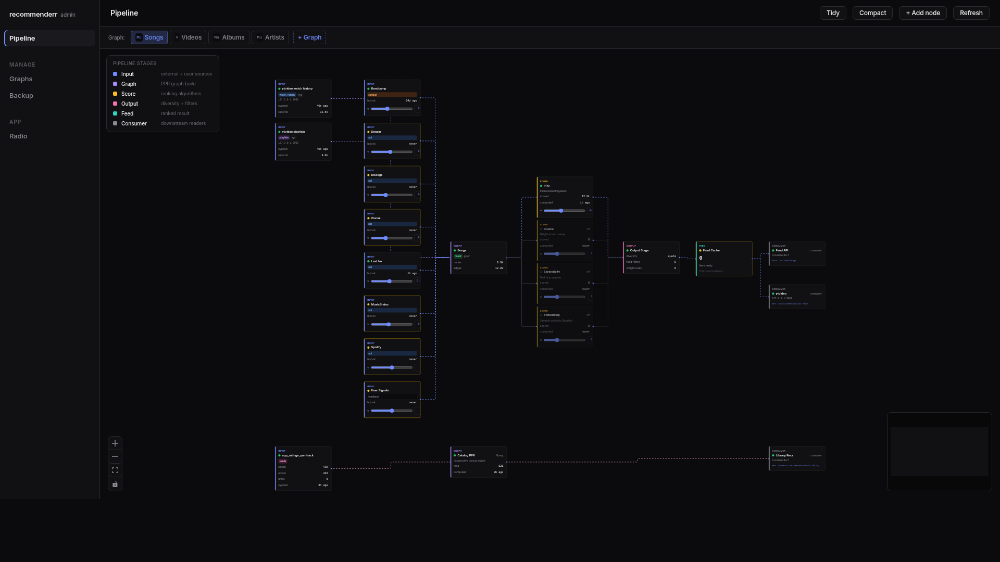
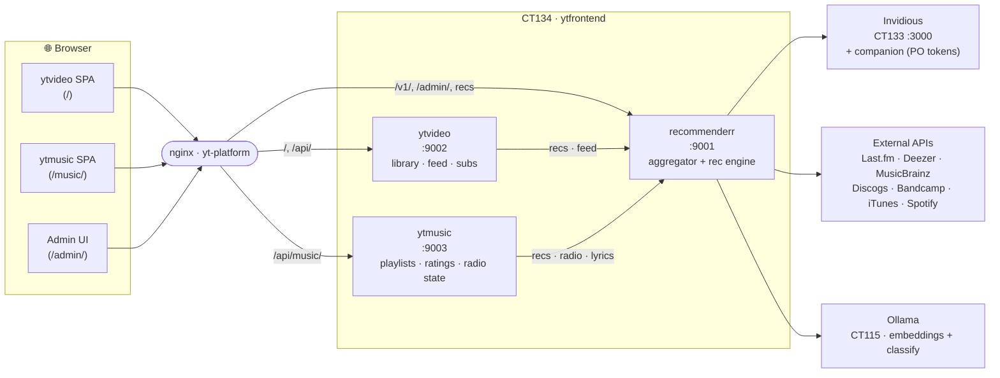
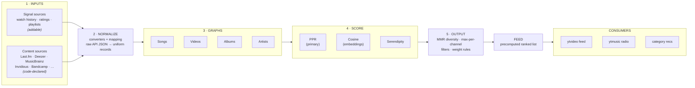

<div align="center">

# yt-platform

**A self-hosted YouTube & YouTube Music frontend with a recommendation engine you can actually see inside.**

Privacy-respecting playback over [Invidious](https://github.com/iv-org/invidious), a library and feed that learn from *your* watching and listening, and a transparent, tunable recommendation pipeline — all running on your own hardware.

[](https://fastapi.tiangolo.com/)
[](https://react.dev/)
[](https://www.sqlite.org/)
[](#deployment)
[](#license)

</div>


_The `recommenderr` admin UI at `/admin/` — every source, scorer, weight, and consumer as a live node-and-cable pipeline you can tune._

---

## Table of contents

- [What is this?](#what-is-this)
- [Why](#why)
- [Architecture](#architecture)
- [The recommendation pipeline](#the-recommendation-pipeline)
- [Components](#components)
- [Tech stack](#tech-stack)
- [Recommendation sources](#recommendation-sources)
- [Repository layout](#repository-layout)
- [Deployment](#deployment)
- [Development](#development)
- [Privacy & egress](#privacy--egress)
- [License](#license)

---

## What is this?

**yt-platform** is a personal, three-service stack that turns YouTube and YouTube Music into a private, self-hosted experience:

- 🎬 **Watch** YouTube without ads, tracking, or an account — streams are fetched through your own [Invidious](https://github.com/iv-org/invidious) instance.
- 🎵 **Listen** with a full music client: playlists, ratings, history, gapless playback, endless radio, lyrics, and now-playing.
- 🧠 **Get recommendations that you control.** A dedicated recommendation engine builds a personalized feed and radio from your own library — and exposes every source, weight, and scorer in a visual pipeline you can tune.

Unlike a single monolithic app, the heavy "talk to the outside world" logic lives in one service (`recommenderr`), while the two user-facing frontends (`ytvideo`, `ytmusic`) own only *your* state. The recommender's flakiness — rate limits, broken third-party APIs — can never take down the player.

> **Note on the name:** `yt-platform` is the umbrella name (it matches the nginx site that fronts everything). The three services are `recommenderr`, `ytvideo`, and `ytmusic`.

## Why

Most self-hosted YouTube frontends stop at "play the video without ads." This project goes further:

- **Recommendations are a first-class, debuggable system, not a black box.** The aggregator has its own admin UI — a node-and-cable canvas where you can watch what each source returns, adjust weights, enable/disable scorers, and see *why* a given item was recommended.
- **The recommender owns the external world; the frontends own user state.** This separation keeps the player fast and resilient, and makes the rec/data layer reusable if a fourth consumer ever appears (a mobile companion, a CLI…).
- **Everything is yours.** Your watch history, ratings, playlists, and listening sessions live in local SQLite databases on your own machine.

---

## Architecture

Three FastAPI services behind one nginx site, plus an Invidious instance for actual YouTube egress.



**Routing at a glance** (nginx site `yt-platform`):

| Path                         | → Service        | Purpose                                              |
| ---------------------------- | ---------------- | --------------------------------------------------- |
| `/`                          | static SPA       | Video frontend                                      |
| `/music/`                    | static SPA       | Music frontend                                      |
| `/api/local/`, `/api/mpv/`   | ytvideo `:9002`  | Library, feed, subscriptions, playback              |
| `/api/music/`                | ytmusic `:9003`  | Playlists, history, ratings, continue-listening     |
| `/api/`, `/v1/`, `/admin/`   | recommenderr `:9001` | Video/search/Invidious proxy, recs, admin UI    |

---

## The recommendation pipeline

`recommenderr` is built as an explicit left-to-right pipeline. Its admin UI renders this as an interactive node-and-cable canvas; the same model is shown below.



The five stages:

1. **Inputs** — *signal sources* (your behavior: watches, ratings, playlists) and *content sources* (third-party music/video APIs and scrapers). Signal sources are user-addable; content sources are code-declared and only *configured* (enable, weight, credentials).
2. **Normalize** — converters map each source's raw JSON into the uniform record shape the graph needs. Some sources run passthrough.
3. **Graphs** — one personalized-PageRank graph per content type (Songs / Videos / Albums / Artists).
4. **Score** — **PPR** is the primary scorer, with optional **Cosine** (Ollama embeddings, Rocchio), **Serendipity**, and **custom sandboxed modules** blended in. Per-listener **personas** can be scored independently. Every scorer's enabled-state and weight is visible and tunable.
5. **Output → Feed → Consumers** — diversity/dedup/filtering produce a precomputed ranked feed, which the frontends read. A per-graph feed-generation counter lets consumers detect a recompute and re-warm their caches.

> **Explainability:** every recommendation can answer *"why am I seeing this?"* — the engine traces the seeds and weights that produced each item (`GET /why/{id}`), surfaced as a panel in the UI with per-seed boost/block controls.

---

## Components

### `recommenderr` — aggregator + recommendation engine `:9001`

The brain. Owns all external integrations, all recommendation logic, third-party API keys, and rate limiters. Serves the admin UI at `/admin/`.

- Personalized-PageRank feed/radio engine (`ppr_engine.py`)
- Optional embedding (cosine, Ollama/Rocchio) and serendipity scorers
- **Custom scoring modules** — user-defined scorers run in a sandboxed `RestrictedPython` engine and added to the pipeline at runtime
- **Listener personas** — multiple taste profiles, each with its own seeds/weights, scored independently
- Invidious proxy (recommendations, trending, comments, storyboards)
- Music enrichment & recognition (MusicBrainz, Last.fm, Deezer, Discogs, Bandcamp, iTunes, Spotify)
- Genre/mood/decade music classifier (vocab-constrained, Ollama-assisted)
- Source **crawler** for proactive catalog expansion, plus favorites/ratings → tags & genres sync
- Per-source rate limiters, circuit breakers, health tracking, and **VPN exit rotation** (`exit_manager`)
- Per-video / per-track response caching with feed-generation invalidation
- In-library radio, category recommendations, keyword suppression
- Visual pipeline admin UI (sources, weights, scorers, modules, consumers)

### `ytvideo` — video frontend backend `:9002`

User-facing video state. Local library, watch history, video playlists, ratings, tags, categories, subscriptions (RSS), Google Takeout import, and mpv control. Delegates every YouTube/Invidious fetch and the feed scoring to `recommenderr`.

### `ytmusic` — music frontend backend `:9003`

User-facing music state. Playlists, listening history, album & track ratings, artist follows, tags, and continue-listening. Calls `recommenderr` for enrichment, recommendations, radio, and lyrics; owns playback-session state (current track, skip history, thumbs).

### Frontend (shared React tree) — [`ytfrontend`](https://github.com/iversonianGremling/ytfrontend)

Lives in its own repo, [`ytfrontend`](https://github.com/iversonianGremling/ytfrontend), which doubles as
the platform's umbrella/"get-all" entry point. A single React + Vite + Tailwind codebase builds two SPAs
from one tree:

- `vite build` → `dist/` → served at `/` (video)
- `vite build --config vite.config.music.ts` → `dist-music/` → served at `/music/`

State via Zustand, routing via React Router, icons via lucide-react.

---

## Tech stack

| Layer        | Tech                                                                 |
| ------------ | ------------------------------------------------------------------- |
| Backend      | Python 3 · FastAPI · Uvicorn · httpx · Pydantic v2                  |
| Recsys       | Personalized PageRank · cosine (Ollama embeddings) · serendipity    |
| Media        | yt-dlp · Invidious + invidious-companion · mpv                      |
| Scraping     | BeautifulSoup · RestrictedPython (sandboxed source modules)         |
| Rate limits  | pyrate-limiter · requests-ratelimiter · per-source circuit breakers |
| Storage      | SQLite (WAL) — one DB per service                                   |
| Frontend     | React 18 · Vite 6 · TypeScript · Tailwind · Zustand · React Router  |
| Auxiliary    | Ollama (CT115) for embeddings + classification                     |
| Deploy       | Proxmox LXC · systemd · nginx                                       |

---

## Recommendation sources

Sources are **code-declared** (`source_registry.py`) — the UI can enable, weight, and credential them, but only code can add new ones. Each has its own weight, rate limit, and circuit-breaker policy.

| Source       | Kind     | Default weight | Credentials       |
| ------------ | -------- | -------------- | ----------------- |
| Spotify      | API      | 1.00           | client id/secret  |
| Deezer       | API      | 0.90           | —                 |
| Last.fm      | API      | 0.85           | API key           |
| MusicBrainz  | API      | 0.80           | —                 |
| Bandcamp     | scraper  | 0.70           | —                 |
| Discogs      | API      | 0.60           | token             |
| iTunes       | API      | 0.55           | —                 |
| Invidious    | extractor| —              | — (your instance) |
| yt-dlp       | extractor| —              | —                 |
| YouTube RSS  | feed     | —              | —                 |
| user signals | internal | —              | —                 |

---

## Repository layout

Each service is a self-contained FastAPI app deployed to its own directory on CT134.

```
recommenderr/                aggregator + rec engine (:9001)
├── backend/
│   ├── main.py
│   ├── routers/             video, music, radio, admin, ppr, sources, graphs, …
│   ├── services/            ppr_engine, embedding_engine, source_registry,
│   │                        music_classifier, category_recs, radio_*, crawler, …
│   ├── clients/
│   ├── db/  schema.sql
│   └── tests/
├── admin-ui/                React pipeline-canvas admin (builds to dist/)
└── requirements.txt

ytvideo/                     video frontend backend (:9002)
└── backend/  routers/ (feed, subscriptions, playlists, history, ratings,
                        tags, categories, imports, mpv) · services · clients

ytmusic/                     music frontend backend (:9003)
└── backend/  routers/ (playlists, history, ratings, artists, tags,
                        music_categories) · services · clients

frontend/                    shared React+Vite tree → dist/ (video) + dist-music/ (music)
                             ↳ its own repo: github.com/iversonianGremling/ytfrontend (umbrella)
```

---

## Deployment

Runs as three `systemd` services inside a Proxmox LXC (CT134), fronted by nginx, with Invidious in a separate container (CT133).

```bash
# Each service: a FastAPI app started from its own directory
#   recommenderr.service  →  python -m backend.main   (cwd /opt/recommenderr, :9001)
#   ytvideo.service       →  python -m backend.main   (cwd /opt/ytvideo,      :9002)
#   ytmusic.service       →  python -m backend.main   (cwd /opt/ytmusic,      :9003)

systemctl restart recommenderr ytvideo ytmusic
systemctl status  recommenderr ytvideo ytmusic
```

Build the frontends from the shared tree:

```bash
cd frontend
npm install
npm run build:all       # → dist/ (video) and dist-music/ (music)
```

Build the admin UI:

```bash
cd recommenderr/admin-ui
npm install && npm run build   # → dist/, served by recommenderr at :9001/admin/
```

After changing PPR seed weights, **restart `recommenderr` and recompute** so the
precomputed feed picks them up:

```bash
curl -X POST http://127.0.0.1/api/local/feed/recompute
```

---

## Development

Each backend uses `pytest`:

```bash
cd recommenderr && python -m pytest      # also: ytvideo/, ytmusic/
```

Frontend:

```bash
cd frontend
npm run dev          # video SPA
npm run dev:music    # music SPA
npm run test         # vitest
npm run lint
```

Configuration is via environment variables / `.env` per service (e.g. `DB_PATH`,
`LISTEN_HOST`, `LISTEN_PORT`, `DISABLE_WORKERS`, and per-source API credentials).

---

## Privacy & egress

- All YouTube playback and metadata fetching is proxied through your own
  **Invidious** instance (with `invidious-companion` for PO tokens); the browser
  never talks to Google directly.
- Recommendation egress (recs, trending, InnerTube `browse`/`next`) is routed
  through Invidious / privoxy → Tor, and outbound source calls share a VPN exit.
- Per-source **rate limiters and circuit breakers** keep third-party APIs from
  being hammered and protect against IP bans; responses are cached aggressively.
- Lyrics resolution falls back through a Cloudflare solver (byparr) without
  changing your VPN path.
- Your data — history, ratings, playlists, listening sessions — stays in local
  SQLite files. Nothing is sent to an analytics or cloud service.

---

## License

Personal / self-hosted project. No public license granted — adapt for your own use.

---

<div align="center">
<sub>Built for a homelab. Inspired by Invidious, Piped, and FreeTube — extended with a recommendation engine you can open up and tune.</sub>
</div>
